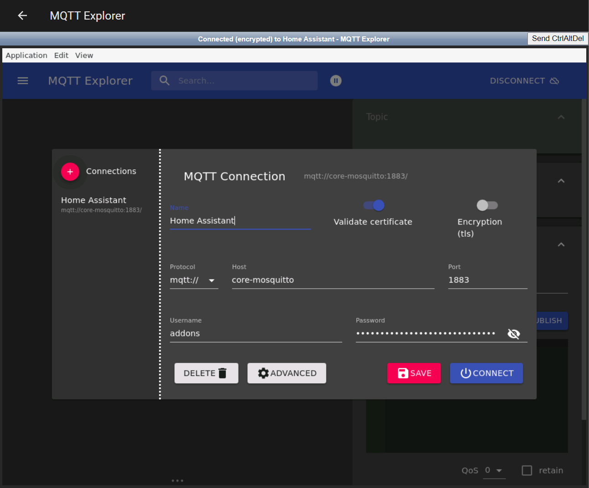
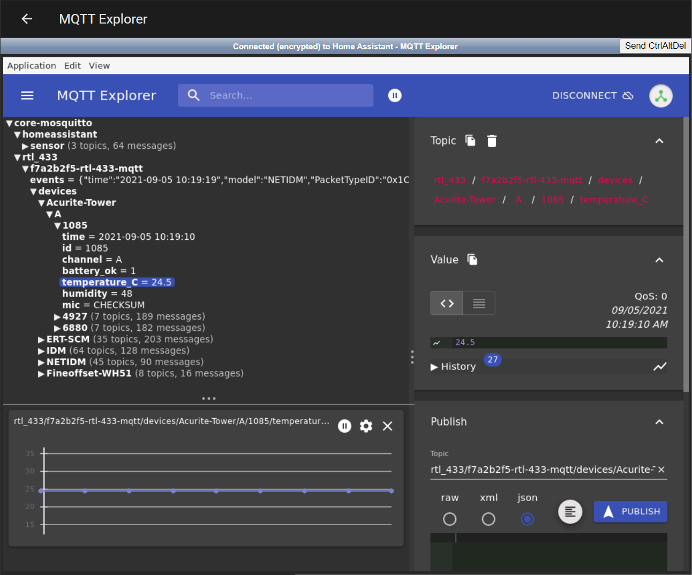

# Home Assistant Custom Add-on: MQTT Explorer

[![GitHub Release][releases-shield]][releases]
![Project Stage][project-stage-shield]
[![License][license-shield]](LICENSE.md)

![Supports aarch64 Architecture][aarch64-shield]
![Supports amd64 Architecture][amd64-shield]
![Supports armv7 Architecture][armv7-shield]

[![Github Actions][github-actions-shield]][github-actions]
![Project Maintenance][maintenance-shield]
[![GitHub Activity][commits-shield]][commits]

A Home Assistant addon to run MQTT Explorer.

## About

MQTT Explorer is a comprehensive MQTT client that provides a structured overview of your MQTT topics and makes working with devices/services on your broker dead-simple. Please support the developer of this software at [MQTT Explorer][mqtt-explorer].

This addon provides an ingress environment for running MQTT Explorer.




## Installation

1. Use the following URL to add this repository:

```txt
https://github.com/csacca/hassio-addons
```

1. Search the Supervisor Add-on store for `MQTT Explorer`.

1. Start the `MQTT Explorer` add-on.

1. Click the `OPEN WEB UI` button

**Note**: This add-on requires a configured MQTT Broker in Home Assistant (it auto configures MQTT Explorer)

## Authors & contributors

The author of [MQTT Explorer][mqtt-explorer] is [Thomas Nordquist][thomasnordquist]

The original setup of this repository is by [Christopher Sacca][csacca].

For a full list of all authors and contributors,
check [the contributor's page][contributors].

[aarch64-shield]: https://img.shields.io/badge/aarch64-yes-green.svg
[amd64-shield]: https://img.shields.io/badge/amd64-yes-green.svg
[armv7-shield]: https://img.shields.io/badge/armv7-yes-green.svg
[commits-shield]: https://img.shields.io/github/commit-activity/y/csacca/addon-mqtt-explorer.svg
[commits]: https://github.com/csacca/addon-mqtt-explorer/commits/main
[contributors]: https://github.com/csacca/addon-mqtt-explorer/graphs/contributors
[csacca]: https://github.com/frenck
[docs]: https://github.com/csacca/addon-mqtt-explorer/blob/main/mqtt-explorer/DOCS.md
[github-actions-shield]: https://github.com/csacca/addon-mqtt-explorer/workflows/CI/badge.svg
[github-actions]: https://github.com/csacca/addon-mqtt-explorer/actions
[issue]: https://github.com/csacca/addon-mqtt-explorer/issues
[license-shield]: https://img.shields.io/github/license/csacca/addon-mqtt-explorer.svg
[maintenance-shield]: https://img.shields.io/maintenance/yes/2021.svg
[mqtt-explorer]: http://mqtt-explorer.com/
[project-stage-shield]: https://img.shields.io/badge/project%20stage-experimental-yellow.svg
[releases-shield]: https://img.shields.io/github/release/csacca/addon-mqtt-explorer.svg
[releases]: https://github.com/csacca/addon-mqtt-explorer/releases
[repository]: https://github.com/csacca/hassio-addons
[semver]: http://semver.org/spec/v2.0.0.htm
[thomasnordquist]: https://github.com/thomasnordquist
